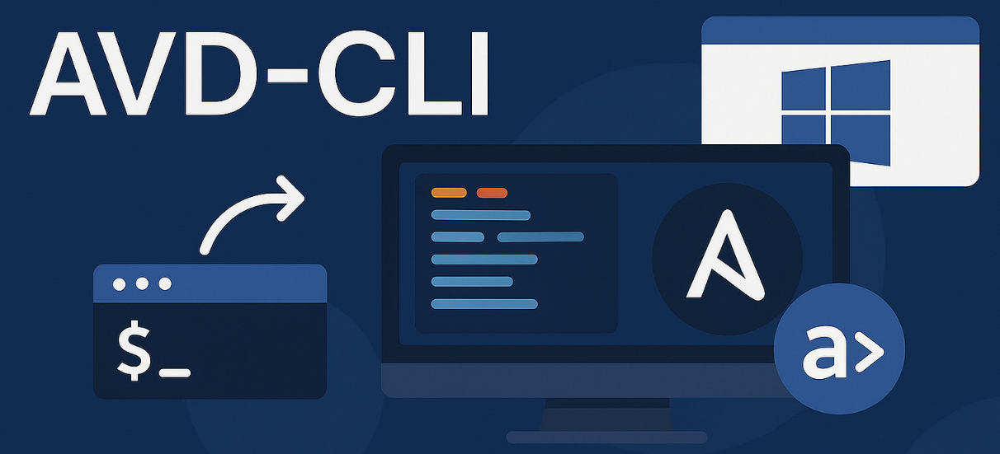

# AVD CLI

A command-line interface for processing Arista AVD inventories and generating configurations, documentation, and tests.

!!! warning "Personal Project Notice"
    This project (`avd-cli`) is a **personal project** and is **not an official development** of the Arista AVD team or Arista Networks.

    It is maintained independently and is not endorsed, supported, or affiliated with Arista Networks, Inc.

    For official AVD tools and support, please visit [avd.arista.com](https://avd.arista.com/).


## What it does

- **Generate configurations** from AVD inventory files
- **Create documentation** automatically
- **Deploy configurations** to EOS devices via eAPI
- **Validate inventory** structure and data
- **Output ANTA tests** for network validation

<div align="center">
    
</div>


## Quick Start

```bash
# Install avd-cli
pipx install git+https://github.com/titom73/avd-cli.git

# Generate all outputs (configs, docs, tests)
avd-cli generate all \
  --inventory-path ./inventory \
  --output-path ./output \
  --workflow eos-design

→ Loading inventory...
✓ Loaded 10 devices
→ Generating configurations, documentation, and tests...

✓ Generation complete!
                      Generated Files
┏━━━━━━━━━━━━━━━━┳━━━━━━━┳━━━━━━━━━━━━━━━━━━━━━━━━━━━━━━━━┓
┃ Category       ┃ Count ┃ Output Path                    ┃
┡━━━━━━━━━━━━━━━━╇━━━━━━━╇━━━━━━━━━━━━━━━━━━━━━━━━━━━━━━━━┩
│ Configurations │    10 │ ./output/configs               │
│ Documentation  │    10 │ ./output/documentation         │
│ Tests          │     1 │ ./output/tests                 │
└────────────────┴───────┴────────────────────────────────┘

# Deploy configurations to EOS devices
avd-cli deploy eos --inventory-path ./inventory --dry-run --diff

→ Loading inventory...
✓ Loaded 10 devices

Deployment Plan (dry-run)
  Mode: replace
  Targets: 10 devices
  Concurrency: 10 devices

⠼ Deploying to 10 devices...

                      Deployment Status
┏━━━━━━━━━━━┳━━━━━━━━━┳━━━━━━━━━━┳━━━━━━━━━━━━┳━━━━━━━┓
┃ Hostname  ┃ Status  ┃ Duration ┃ Diff (+/-) ┃ Error ┃
┡━━━━━━━━━━━╇━━━━━━━━━╇━━━━━━━━━━╇━━━━━━━━━━━━╇━━━━━━━┩
│ spine-1   │ success │ 2.34s    │ +15 / -3   │       │
│ spine-2   │ success │ 1.89s    │ +45 / -10  │       │
│ leaf-1    │ success │ 3.12s    │ +12 / -2   │       │
│ ...       │ ...     │ ...      │ ...        │       │
└───────────┴─────────┴──────────┴────────────┴───────┘
```

---

## 💡 Advanced Features

- **Jinja2 Template Support**: Full support for Jinja2 variables and expressions in inventory files
- **Variable Inheritance**: Sophisticated variable inheritance across inventory hierarchy
- **Flexible Variable Organization**: Support for both files and directories in group_vars/host_vars
- **Environment Variables**: All CLI options support `AVD_CLI_*` environment variables
- **Rich Terminal Output**: Beautiful and informative CLI experience with color-coded messages

---

## 📖 Documentation

<div class="grid cards" markdown>

- :material-download:{ .lg .middle } **Getting Started**

    ---

    Installation, quick start guide, and basic usage examples

    [:octicons-arrow-right-24: Get Started](getting-started/installation.md)

- :material-book-open-variant:{ .lg .middle } **User Guide**

    ---

    Comprehensive guide covering all commands, inventory structure, and advanced features

    [:octicons-arrow-right-24: User Guide](user-guide/commands/overview.md)

- :material-code-braces:{ .lg .middle } **API Reference**

    ---

    Detailed API documentation for all modules and functions

    [:octicons-arrow-right-24: API Docs](api/cli/main.md)

- :material-frequently-asked-questions:{ .lg .middle } **FAQ**

    ---

    Frequently asked questions and troubleshooting tips

    [:octicons-arrow-right-24: FAQ](faq.md)

</div>

---

## 🤝 Contributing

Contributions are welcome! Check out our [Contributing Guide](development/contributing.md) for:

- Development environment setup
- Running tests and quality checks
- Code style guidelines
- Pull request process

---

## 📄 License

This project is licensed under the Apache License 2.0 - see the [LICENSE](https://github.com/titom73/avd-cli/blob/main/LICENSE) file for details.

---

## 🙏 Acknowledgments

- [Arista Networks](https://www.arista.com/) for AVD
- [Click](https://click.palletsprojects.com/) for the CLI framework
- [Rich](https://github.com/Textualize/rich) for beautiful terminal output
- [pytest](https://pytest.org/) for testing framework
