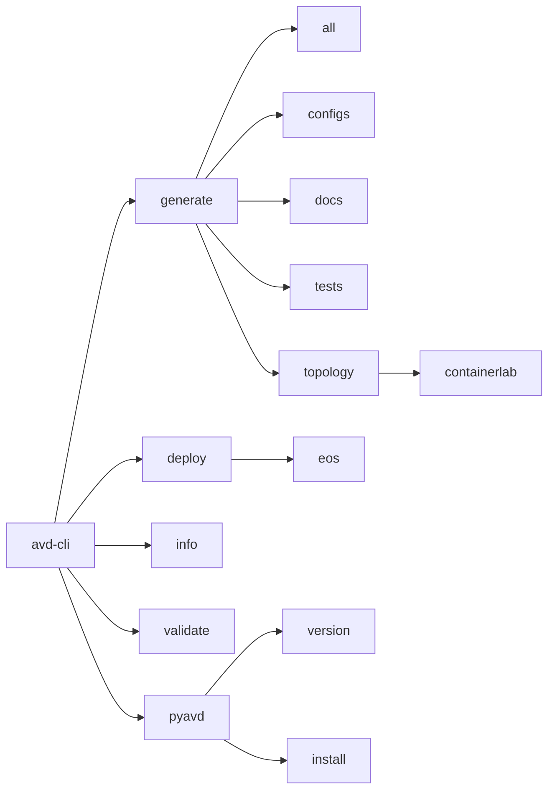

# Commands Overview

AVD CLI provides a comprehensive set of commands for managing your Arista AVD network configurations.

---

## Available Commands

| Command | Description | Learn More |
|---------|-------------|------------|
| **generate** | Generate configurations, documentation, and tests | [Details](generate.md) |
| **deploy** | Deploy configurations to network devices | [Details](deploy.md) |
| **info** | Display inventory information | [Details](info.md) |
| **validate** | Validate inventory structure | [Details](validate.md) |
| **pyavd** | Manage pyavd package version | [Details](pyavd.md) |

---

## Command Hierarchy



---

## Common Patterns

### Using with Environment Variables

```bash
export AVD_CLI_INVENTORY_PATH=./inventory
export AVD_CLI_OUTPUT_PATH=./output

avd-cli generate all
avd-cli deploy eos --dry-run
avd-cli info
avd-cli validate
```

### Using with Explicit Options

```bash
avd-cli generate all -i ./inventory -o ./output
avd-cli deploy eos -i ./inventory --dry-run --diff
avd-cli info -i ./inventory
avd-cli validate -i ./inventory
```

---

## Next Steps

- Learn about the [generate command](generate.md)
- Learn about the [deploy command](deploy.md)
- Learn about the [info command](info.md)
- Learn about the [validate command](validate.md)
- Learn about the [pyavd command](pyavd.md)
